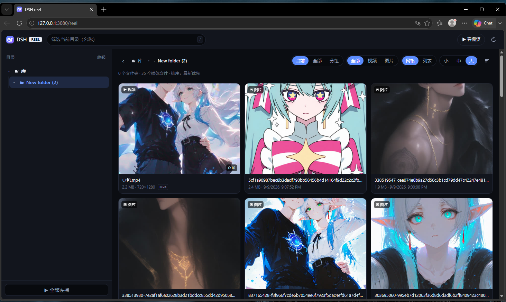
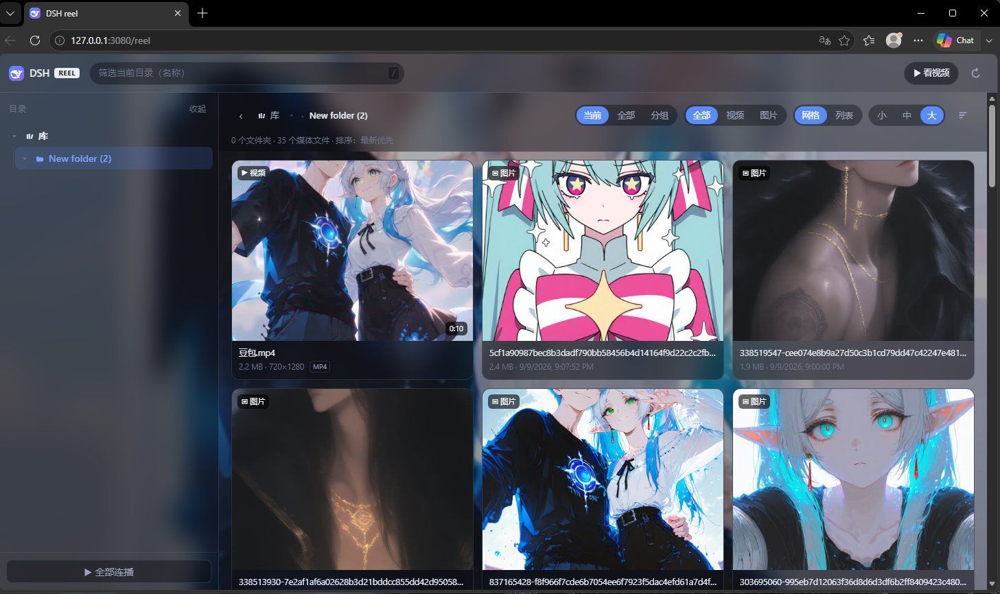
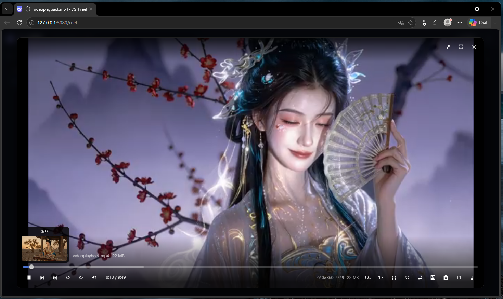
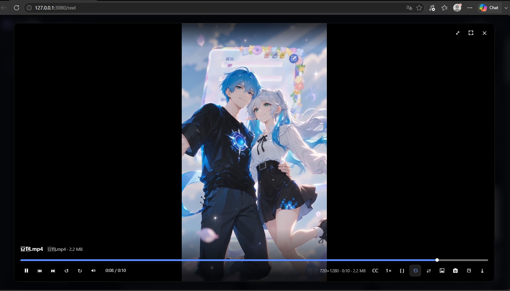
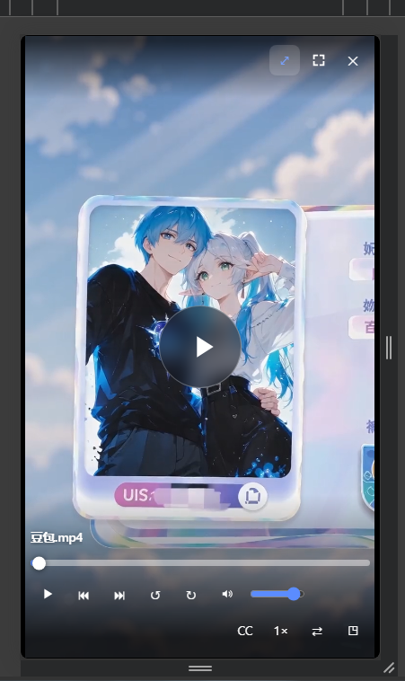
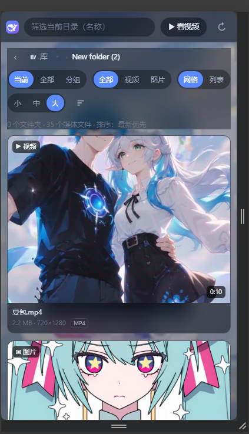
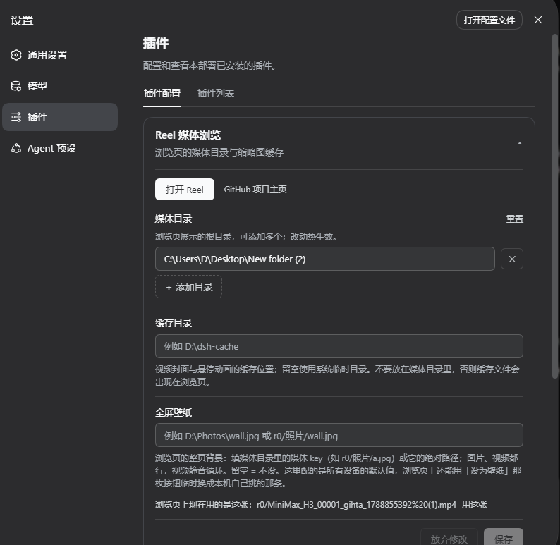

<p align="center">
  
</p>

<h1 align="center">dsh-reel</h1>

<p align="center">
  <strong>A modern media library and immersive gallery plugin crafted for dsh Web.</strong>
</p>

<p align="center">
  Multi-directory aggregation · Zero build step · HTTP Range streaming · Real-time remuxing · Dynamic live wallpaper · Swipe-to-next reels player
</p>

<p align="center">
  
  <a href="https://github.com/deepseek-ai/deepseek-harness/releases/tag/dsh-v0.1.5-rc.1">= v0.1.5-rc.1" /></a>
  
  
  
</p>

<p align="center">
  
  
  
  
</p>

<p align="center">
  <a href="README.md">简体中文</a> · <strong>English</strong>
</p>

---

<p align="center">
  
</p>

## Overview

**dsh-reel** adds an all-in-one media library and audio-visual streaming experience to [dsh Web](https://github.com/deepseek-ai) (requires dsh [v0.1.5-rc.1](https://github.com/deepseek-ai/deepseek-harness/releases/tag/dsh-v0.1.5-rc.1) or later). Without spawning a secondary server process or opening new ports, simply configure local disk folders to instantly browse high-performance image galleries and stream video collections straight from your browser.

Quick access URL:
```
http://127.0.0.1:3080/reel
```

---

## Key Features

- **Zero-Overhead Embedded Architecture**: Shares the same port and origin with dsh Web. Injects only a single Cordis composition row with read-only routes under `/reel`—no daemon process, no compilation/bundling required.
- **Strict Read-Only Sandbox**: Only inspects and reads files inside explicitly allowed root directories. Completely path-traversal proof.
- **Multi-Directory Aggregation & Multi-Dimensional Views**:
  - Top-level virtual "Library" aggregates all mounted directories with lazy subtree loading.
  - Three viewing scopes (cycle with <kbd>G</kbd>): **Current** folder only, **All** (recursively flattened), or **Grouped** (collapsible folder hierarchy).
  - Responsive Grid layout (Small / Medium / Large tile sizes) and compact List view.
- **Instant HTTP Range Streaming**: Native chunked streaming via HTTP Range requests; drag the progress slider and start playback immediately without waiting for buffer downloads.
- **Real-Time On-The-Fly Remuxing**: Legacy or browser-incompatible containers (AVI, WMV, FLV, RMVB, etc.) are remuxed in memory to fragmented MP4 via FFmpeg on the fly, zero temporary disk space used. Seeking simply initiates a fresh stream from the target timestamp.
- **Hover Timeline Preview & Frame Probing**: Hover over the scrubber bar to view miniature thumbnail previews and accurate timestamps. Ships with built-in FFmpeg & FFprobe to auto-extract duration, resolution, and poster cards.
- **Immersive Dynamic Live Wallpaper**:
  - Set any video or photo as a full-page live wallpaper with a single click (videos loop silently, auto-pause when unfocused to conserve resources).
  - Frosted-glass translucent UI styling brings a fluid, stunning visual ambience.
- **Reels-Style Swipe Navigation & Mobile Optimized**:
  - Touch-optimized responsive UI with smooth vertical swipe gestures to jump to next/previous videos (similar to TikTok & Instagram Reels).
  - Continuous playlist playback, shuffle mode, playback position memory, 2× hold-to-speed-up, auto-loading subtitles, and one-click frame snapshots.
- **Native dsh UI Settings Card**: Integrated directly into the dsh Settings page; edits are applied hot without restarting the service.

---

## Screenshots

### Immersive Live Wallpaper Mode
Turn your favorite media into a vibrant dynamic background while keeping the interface translucent:
<p align="center">
  
</p>

### Feature-Rich Media Player
Page-fullscreen player with hover scrubbing thumbnails, media inspector, playback speeds, screenshot exporter, and loop modes:
<p align="center">
  
</p>

### Vertical Videos & Mobile Swipe Experience
Vertical videos are centered with ambient lighting or fullscreened for an intuitive Reels-like experience:
<p align="center">
  
  &nbsp;&nbsp;
  
</p>

### Responsive Mobile Gallery
Streamlined single-column grid view and touch-friendly controls:
<p align="center">
  
</p>

### Native dsh Settings Integration
Configure roots, cache paths, and global wallpapers straight from the graphical settings panel:
<p align="center">
  
</p>

---

## Installation

### Prerequisites

- **dsh**: Minimum version [v0.1.5-rc.1](https://github.com/deepseek-ai/deepseek-harness/releases/tag/dsh-v0.1.5-rc.1) or later
- **Node.js**: `>= 20`

### Standard Install

Run the following command inside your dsh installation:

```powershell
dsh plugin --profile web add dsh-reel
```

Restart `dsh web`, and open in your browser:
```
http://127.0.0.1:3080/reel
```

### Install Pre-release / Local Development Link

```powershell
# Install latest build directly from GitHub
dsh plugin --profile web add "github:lsjspl/dsh-reel"

# Soft-link local source code for live development
dsh plugin --profile web add "link:C:\path\to\dsh-reel"
```

### Uninstallation

```powershell
dsh plugin --profile web remove dsh-reel
```

---

## Configuration

Settings reside under the `reel` namespace in `settings.yaml`. Changes take effect hot without restarts.

### Method 1: Graphical Settings UI (Recommended)

Navigate to **dsh Settings → Plugins → Plugin configuration → Reel Media Library**:
- **Media Directories**: Click "+ Add Directory" to mount local storage paths (e.g. `D:\Photos`, `E:\Videos`).
- **Cache Directory**: Choose where poster frames and hover thumbnails are cached.
- **Fullscreen Wallpaper**: Define default wallpaper image or video.

### Method 2: YAML Configuration / `cordis.patch.yml`

Configure in `cordis.patch.yml` or `settings.yaml`:

```yaml
- id: reel
  config:
    roots:
      - D:\Photos
      - E:\Movies
    # cacheDir: 'D:\dsh-cache'              # Thumbnail cache dir; defaults to OS tempdir
    # wallpaper: 'D:\Photos\wallpaper.jpg'  # Default wallpaper path
    # ffmpegPath: 'D:\ffmpeg\bin\ffmpeg.exe' # Custom ffmpeg binary path
    # requireTrustedRequest: true           # LAN trust fence; false permits non-loopback clients
    # maxScanEntries: 20000                 # Max scanned items (50 ~ 200000)
```

> [!NOTE]
> - If `roots` is empty, fallback priority is: `REEL_ROOTS` environment variable (semicolon-separated) followed by `$DSH_HOME/media`.
> - Keep `cacheDir` outside of your media roots to prevent cache files from cluttering your library.

---

## FFmpeg & FFprobe Resolution Strategy

`dsh-reel` bundles `@ffmpeg-installer/ffmpeg` and `@ffprobe-installer/ffprobe` as runtime dependencies, **requiring zero external setup out of the box**.

To leverage newer hardware acceleration or newer codecs, you can optionally install system-wide FFmpeg:

```powershell
# Windows (WinGet / Scoop / Chocolatey)
winget install ffmpeg

# macOS (Homebrew)
brew install ffmpeg

# Linux (Debian / Ubuntu)
sudo apt update && sudo apt install ffmpeg
```

### Binary Resolution Order:
1. User-configured `ffmpegPath`
2. `$DSH_HOME/reel/bin/` directory
3. System environment `PATH` and package manager bins (WinGet, Scoop, `/usr/local/bin`, etc.)
4. Embedded fallback installer dependencies

---

## Keyboard Shortcuts

### Gallery & Library Navigation

| Key | Action |
|:---:|:---|
| <kbd>G</kbd> | Cycle content scope (Current → All Flat → Grouped) |
| <kbd>V</kbd> | Toggle Grid vs. List view |
| <kbd>S</kbd> | Toggle sort criteria (Newest, Name, Size) |
| <kbd>R</kbd> | Reload and refresh library |
| <kbd>/</kbd> | Focus instant search box |
| <kbd>Backspace</kbd> / <kbd>Ctrl</kbd>+<kbd>↑</kbd> | Go up one directory level |
| <kbd>Esc</kbd> | Close lightbox viewer / blur search |

### Video Player

| Key | Action |
|:---:|:---|
| <kbd>Space</kbd> / <kbd>K</kbd> | Play / Pause |
| <kbd>←</kbd> / <kbd>→</kbd> | Seek backward / forward 5s |
| <kbd>J</kbd> / <kbd>L</kbd> | Seek backward / forward 10s |
| <kbd>↑</kbd> / <kbd>↓</kbd> | Volume step (±5%) |
| <kbd>M</kbd> | Mute / Unmute |
| <kbd>F</kbd> | Fullscreen / Exit fullscreen |
| <kbd>Q</kbd> | Toggle Picture-in-Picture (PiP) |
| <kbd>C</kbd> | Open / Close subtitles menu |
| <kbd>I</kbd> | Toggle Stats for Nerds |
| <kbd>U</kbd> | Toggle Single Loop / Queue autoplay |
| <kbd>P</kbd> | Capture current frame snapshot as PNG |
| <kbd>D</kbd> | Download original media file |
| <kbd>[</kbd> / <kbd>]</kbd> | Decrease / Increase playback speed (0.25× ~ 3×) |
| <kbd>0</kbd> | Reset playback speed to 1.0× |
| <kbd>Home</kbd> / <kbd>End</kbd> | Jump to video start / end |
| <kbd>Esc</kbd> | Exit fullscreen / Close menus / Exit player |
| **Mouse Left Hold** | 2.0× Rapid fast-forward (restores on release) |
| **Mouse Wheel / Touch Swipe** | Switch to previous / next video (Reels swipe navigation) |

---

## Friendly Links

- [linux.do](https://linux.do/) - 新的理想型社区。

---

## License

This project is licensed under the [MIT License](LICENSE).
