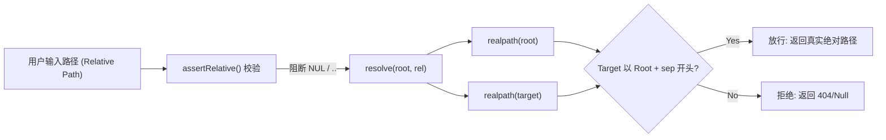
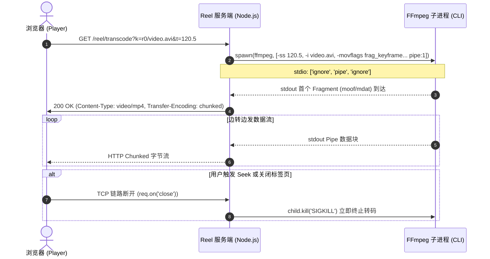
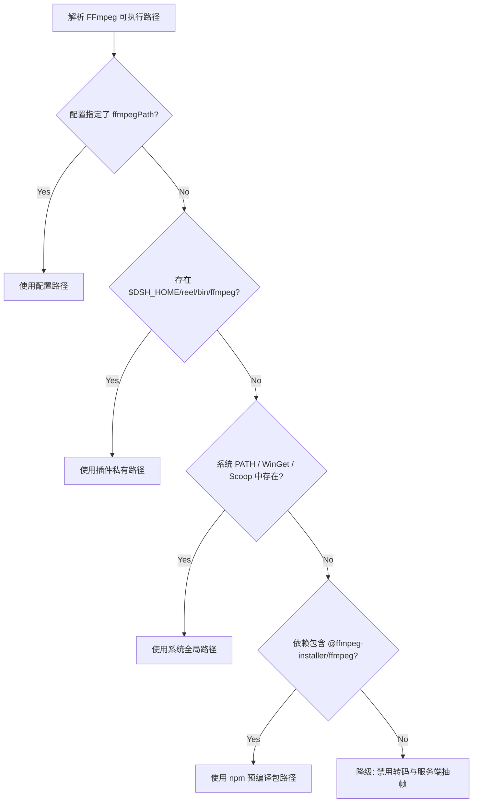

# DSH Reel 架构与技术实现规范文档 (Technical Specification)

本文档面向系统研发人员与架构维护者，深入剖析 `dsh-reel` 的系统架构、协议规范、流媒体管道、安全约束、状态机模型以及工程实现细节。

---

## 目录

- [1. 架构定位与设计约束 (Architecture & Constraints)](#1-架构定位与设计约束)
  - [1.1 宿主集成与 IoC 容器模型](#11-宿主集成与-ioc-容器模型)
  - [1.2 零依赖与无构建设计](#12-零依赖与无构建设计)
  - [1.3 配置模型与分层覆盖规范](#13-配置模型与分层覆盖规范)
- [2. 安全模型与遏制证明 (Security & Containment Invariants)](#2-安全模型与遏制证明)
  - [2.1 文件系统只读不变量 (Read-Only Invariant)](#21-文件系统只读不变量-read-only-invariant)
  - [2.2 双向 realpath 包含性证明 (Containment Proof)](#22-双向-realpath-包含性证明-containment-proof)
  - [2.3 信任门禁与回环地址隔离 (Trust Boundary)](#23-信任门禁与回环地址隔离-trust-boundary)
  - [2.4 缓存目录重叠告警与隔离机制](#24-缓存目录重叠告警与隔离机制)
- [3. 数据模型与寻址语义 (Data Models & Addressing Grammar)](#3-数据模型与寻址语义)
  - [3.1 Media Key 编码规范](#31-media-key-编码规范)
  - [3.2 聚合根虚拟化 (Virtual Library)](#32-聚合根虚拟化-virtual-library)
  - [3.3 目录遍历与分页游标模型](#33-目录遍历与分页游标模型)
  - [3.4 递归扫描算法与背压保护](#34-递归扫描算法与背压保护)
- [4. HTTP API 与网络传输协议 (HTTP API & Protocols)](#4-http-api-与网络传输协议)
  - [4.1 API 端点规约全集](#41-api-端点规约全集)
  - [4.2 RFC 7233 范围流传输 (HTTP 206 Range)](#42-rfc-7233-范围流传输-http-206-range)
  - [4.3 ETag 强校验与 RFC 5987 标头安全传输](#43-etag-强校验与-rfc-5987-标头安全传输)
- [5. 流媒体处理引擎与管道实现 (Media Processing Pipeline)](#5-流媒体处理引擎与管道实现)
  - [5.1 服务端实时 Fragmented MP4 转封装管道](#51-服务端实时-fragmented-mp4-转封装管道)
  - [5.2 毫秒级 Seek 与流重启机制](#52-毫秒级-seek-与流重启机制)
  - [5.3 封面抽帧与悬停微视频生成架构](#53-封面抽帧与悬停微视频生成架构)
  - [5.4 进程池并发控制与失败熔断机制 (Miss Cache)](#54-进程池并发控制与失败熔断机制-miss-cache)
  - [5.5 FFmpeg / FFprobe 多级探查与 CJS 桥接策略](#55-ffmpeg--ffprobe-多级探查与-cjs-桥接策略)
  - [5.6 外挂字幕流式转换状态机 (SRT/ASS/SSA -> WebVTT)](#56-外挂字幕流式转换状态机-srtassssa---webvtt)
- [6. 前端架构与状态机设计 (Frontend Architecture & State Machine)](#6-前端架构与状态机设计)
  - [6.1 单一状态树 (Single State Tree) 与渲染流水线](#61-单一状态树-single-state-tree-与渲染流水线)
  - [6.2 路径面包屑自适应折叠算法](#62-路径面包屑自适应折叠算法)
  - [6.3 播放引擎 (player.js) 状态与手势动力学](#63-播放引擎-playerjs-状态与手势动力学)
  - [6.4 全屏壁纸引擎与渲染层叠上下文](#64-全屏壁纸引擎与渲染层叠上下文)
- [7. DSH 客户端扩展集成 (DSH Host Client Integration)](#7-dsh-客户端扩展集成-dsh-host-client-integration)
  - [7.1 惰性 CJS 模块加载协议](#71-惰性-cjs-模块加载协议)
  - [7.2 免构建 React 声明范式](#72-免构建-react-声明范式)
  - [7.3 Cordis UI 插槽挂载机制](#73-cordis-ui-插槽挂载机制)
- [8. 测试工程与沙箱验证矩阵 (Testing & Verification Matrix)](#8-测试工程与沙箱验证矩阵)
  - [8.1 虚拟 Cordis 上下文端到端测试 (tests/run.mjs)](#81-虚拟-cordis-上下文端到端测试-testsrunmjs)
  - [8.2 基于 Node.js VM 的无头 DOM 路径折叠测试 (tests/crumbs.mjs)](#82-基于-nodejs-vm-的无头-dom-路径折叠测试-testscrumbsmjs)
  - [8.3 布局与触控数学模型测试](#83-布局与触控数学模型测试)

---

## 1. 架构定位与设计约束

### 1.1 宿主集成与 IoC 容器模型
`dsh-reel` 是基于 [Cordis](https://cordis.chat/) 微内核框架开发的功能插件（Function Plugin）。插件通过 `cordis.patch.yml` 注入到宿主环境（dsh profile）中：

```yaml
# cordis.patch.yml
- insert:
    - id: reel
      name: 'dsh-reel'
      inject:
        - webServer
      config:
        roots: []
        requireTrustedRequest: true
```

#### 服务声明与生命周期
- **服务注入**：插件显式声明 `export const inject = ['webServer']`。由于 Cordis 的作用域隔离规则，HTTP 路由回调函数脱离了插件主体的同步执行栈，因此必须在 Cordis 配置行级别与模块级别同时声明服务注入，防止异步请求在读取 `ctx.webServer` 时抛出未注入异常。
- **单进程与同源部署**：插件直接将路由挂载在宿主 `webServer` 的统一 HTTP 端口下（统一前缀 `/reel`），完全规避了子进程守护、端口抢占以及 CORS 跨域通信损耗。

### 1.2 零依赖与无构建设计
为保证系统在多平台运行时的极致轻量与高可靠性，项目严格遵循以下工程约束：
1. **服务端零外部运行依赖**：服务端代码全部由 Node.js 原生模块驱动（`node:child_process`, `node:crypto`, `node:fs`, `node:http`, `node:path` 等）。除随包附带的 FFmpeg 静态二进制兜底模块外，无额外第三方 npm 依赖。
2. **免编译流水线**：前端完全基于原生 ES 标准实现（Vanilla JavaScript + 原生 CSS Variables），不引入 Webpack、Vite 或 Babel 等编译链路。代码以纯静态资产直出交付，修改后立即生效。

### 1.3 配置模型与分层覆盖规范
插件对外导出了符合 [Standard Schema](https://github.com/standard-schema/standard-schema) 规范的配置校验器：

```javascript
// lib/reel.js
export const Config = {
  '~standard': {
    version: 1,
    vendor: 'dsh-reel',
    validate(value) { /* 强类型边界校验 */ }
  }
}
```

#### 配置解析优先级链 (Cascading Configuration)
配置系统支持热重载（Hot-reload），生效顺序严格由高到低降级：
1. **DSH 用户设置层 (User Settings Layer)**：通过 DSH 设置中心面板由用户修改并落盘至 `settings.yaml` 的配置；
2. **编排层初始配置 (Composition Row Entry)**：`cordis.patch.yml` 中配置的静态参数；
3. **环境变量层 (Environment Fallback)**：读取 `REEL_ROOTS`（以操作系统路径分隔符分割的目录列表）；
4. **系统缺省兜底**：使用 `$DSH_HOME/media`（若目录物理存在）。

---

## 2. 安全模型与遏制证明 (Security & Containment Invariants)

### 2.1 文件系统只读不变量 (Read-Only Invariant)
媒体服务端对挂载的所有媒体目录拥有**强只读约束**：
- 针对用户配置的媒体目录，底层调用的文件系统 API 集合被严格限制在只读范围：`stat`, `readdir`, `open` (带 `'r'` 标记), `readFile`。
- 所有动态派生的资源（缩略图、微视频动图、缺失记录等）强制存放于配置的 `cacheDir`（缺省为操作系统临时目录 `join(tmpdir(), 'dsh-reel-thumbs')`），绝不允许在媒体源目录中创建任何临时文件或索引缓存。

### 2.2 双向 realpath 包含性证明 (Containment Proof)
针对路径穿越（Directory Traversal）与符号链接穿透（Symlink Escapes），系统实现了双重防线：



1. **第一阶段：语法规整（`assertRelative`）**：
   - 过滤空值并转换反斜杠为标准 POSIX 分隔符 `/`；
   - 强校验：拒绝包含 `\0`（NUL 字节拦截）及切片后含有 `..` 的路径组件，直接抛出 `TypeError`。
2. **第二阶段：双端真实路径包含性验证（`resolveInside`）**：
   ```javascript
   // lib/media.js
   export async function resolveInside(root, relPath) {
     const abs = relPath === '' ? root : resolve(root, relPath)
     let real
     try {
       real = await realpath(abs)
     } catch {
       return null
     }
     if (real !== root && !real.startsWith(root + sep)) return null
     return { abs: real, rel: relative(root, real).split(sep).join('/') }
   }
   ```
   由于操作系统中软链接可在任何层级跳跃到挂载根目录之外，简单的字符串前缀比对无法免疫攻击。此处在解析前对挂载根与目标绝对路径双双执行系统调用 `realpath`，只有当目标物理真实路径严格以 `root + sep` 作为前缀时才判定合法。

### 2.3 信任门禁与回环地址隔离 (Trust Boundary)
- **本地回环判定**：通过 `isLoopback(address)` 识别 `127.0.0.1`、`::1` 以及 IPv4-mapped 格式 `::ffff:127.0.0.1`。
- **局域网信任屏障**：在配置 `requireTrustedRequest: true`（默认启用）时，非回环地址的局域网入站请求必须通过宿主注入的 `ctx.webServer.isTrusted(req)` 门禁验证，否则直接阻断访问，防止内网未鉴权嗅探。

### 2.4 缓存目录重叠告警与隔离机制
为防止用户误将 `cacheDir` 设置在媒体目录内部，导致哈希命名的缓存图片出现在媒体列表视图中，服务端在每次启动及配置更新时执行重叠检测（`warnCacheInsideRoot`）：
- 通过对 `cacheDir` 与各个 `roots` 的前缀碰撞检查，一旦发现重叠即在宿主日志输出 `WARN` 告警。

---

## 3. 数据模型与寻址语义 (Data Models & Addressing Grammar)

### 3.1 Media Key 编码规范
系统通过统一的 `Media Key` 语法在网络协议层定位资源，避免直接暴露宿主机器的文件绝对路径：

```text
MediaKey := "r" + RootIndex + ["/" + URLEncodedRelativePath]
```

- **示例**：
  - `r0`：定位至索引为 0 的挂载根目录本身；
  - `r1/Movies%2F2024%2Ftest.mp4`：定位至索引为 1 的根目录下的 `Movies/2024/test.mp4`；
  - 空键或非法键默认自动规约至 `r0`。

### 3.2 聚合根虚拟化 (Virtual Library)
当传入 `k=lib` 时，系统启用虚拟聚合根模式：
- 将所有配置的 `roots` 顶层统一映射为一个全局的虚拟媒体库；
- 聚合模式下屏蔽底层文件系统边界，提供跨盘符/跨目录的全局扁平化检索入口。

### 3.3 目录遍历与分页游标模型
为平衡网络 I/O 与文件系统开销，单层目录查询（`/reel/api/list`）采用切片分页机制：
- **分页步长**：常量 `LIST_PAGE = 400`。
- **返回模型结构**：
  ```json
  {
    "root": { "index": 0, "path": "D:\\Photos", "label": "Photos" },
    "key": "r0/Family",
    "name": "Family",
    "parent": "r0",
    "crumbs": [
      { "name": "Photos", "key": "r0" },
      { "name": "Family", "key": "r0/Family" }
    ],
    "dirs": [
      { "name": "2023", "key": "r0/Family/2023", "media": 12 }
    ],
    "files": [
      {
        "name": "IMG_001.jpg",
        "key": "r0/Family/IMG_001.jpg",
        "kind": "image",
        "size": 2451000,
        "mtimeMs": 1715000000000,
        "thumbUrl": "/reel/thumb?k=r0%2FFamily%2FIMG_001.jpg",
        "streamUrl": "/reel/stream?k=r0%2FFamily%2FIMG_001.jpg"
      }
    ],
    "offset": 0,
    "total": 520,
    "more": true
  }
  ```
- **子目录轻量探测优化**：在枚举子文件夹时，不调用开销巨大的递归 `stat`，而是通过 `countMediaEntries` 仅使用带文件类型标记的 `readdir({ withFileTypes: true })` 进行一级文件浅扫，快速判定子文件夹内是否含有媒体，避免深层 I/O 阻塞。

### 3.4 递归扫描算法与背压保护
全局平铺（All）与目录分组（Folder Grouping）依赖递归扫描接口（`/reel/api/scan`）：
- **动态深度与类型过滤**：支持 `kinds=image,video` 参数动态裁剪。
- **软硬双重保护阈值**：
  - **软限制 (`maxScanEntries`)**：用户可配置，默认 `20,000`，超额后截断扫描并置 `truncated: true`；
  - **单次请求硬上限 (`SCAN_HARD_LIMIT = 3000`)**：单次 HTTP 响应返回的最大媒体对象数，防止前端反序列化超大 JSON 导致渲染主线程假死。

---

## 4. HTTP API 与网络传输协议 (HTTP API & Protocols)

### 4.1 API 端点规约全集

| Method | Endpoint | Query / Body 规范 | 状态码与响应格式 | 缓存策略 (Cache-Control) |
|---|---|---|---|---|
| `GET` | `/reel/api/session` | 无 | `200 OK`: 会话信息、根目录拓扑、编解码器就绪状态 | `no-store` |
| `GET` | `/reel/api/list` | `k`: string (Key)<br>`offset`: int | `200 OK`: 分页目录树与媒体元数据对象<br>`404`: 路径不存在 | `no-store` |
| `GET` | `/reel/api/scan` | `k`: string<br>`kinds`: string<br>`limit`: int<br>`depth`: int | `200 OK`: 递归平铺条目集合与截断标记 | `no-store` |
| `POST` | `/reel/api/probe` | Body: `{"keys": string[]}` (max 200) | `200 OK`: 批量 ffprobe 时长、宽高比及编解码元数据 | `no-store` |
| `GET` | `/reel/api/stat` | `k`: string | `200 OK`: 单文件属性及相邻项（Siblings）列表 | `no-store` |
| `GET` | `/reel/stream` | `k`: string<br>`dl`: '1'\|'0' | `206 Partial Content` / `200 OK`: 二进制范围媒体流 | 支持 Range / 带 ETag 协商 |
| `GET` | `/reel/download` | `k`: string | `200 OK`: 强制文件附件下载流 | `attachment` 标头 |
| `GET` | `/reel/transcode` | `k`: string<br>`t`: float (起始秒) | `200 OK`: 实时管道分片 MP4 二进制流<br>`503`: 转码器未就绪 | `no-store`, `nosniff` |
| `GET` | `/reel/thumb` | `k`: string | `200 OK`: 缩略图 JPEG 二进制字节<br>`503`: 抽帧不可用 | `private, max-age=86400` |
| `GET` | `/reel/preview` | `k`: string | `200 OK`: 4秒微视频 WebM 二进制字节 | `private, max-age=86400, immutable` |
| `GET` | `/reel/subtitle` | `k`: string | `200 OK`: 标准 WebVTT 格式字幕流 | `private, max-age=3600` |

### 4.2 RFC 7233 范围流传输 (HTTP 206 Range)
底层媒体推流通过 `streamEntry` 与 `streamRange` 实现了严格的 HTTP 分片协议：

#### Range 解析状态机 (`parseRange`)
- 仅处理单范围请求（Single-range request），遇到多范围（Multi-range）直接降级为全量 `200 OK` 交付；
- 支持语法：
  - `bytes=100-200`（闭区间切片）；
  - `bytes=100-`（从指定字节至文件末尾）；
  - `bytes=-500`（后缀形式，提取最后 500 字节）。
- **边界防卫**：
  - 遇到起始偏移超出文件长度或逆向区间（`start > end`），返回 `unsatisfiable`，服务端响应 `416 Range Not Satisfiable` 并附带标头 `Content-Range: bytes */size`。

#### 高水位缓冲吞吐调优
```javascript
// lib/media.js
export function streamRange(abs, start, end) {
  return createReadStream(abs, { start, end, highWaterMark: 1 << 18 }) // 256 KiB
}
```
内部采用 `256 KiB`（`1 << 18`）的 `highWaterMark`。此设计避免了高频小的 I/O 读取，同时保证单个 Socket 连接不会因为大尺寸 TCP 窗口而在内存中积压整段 GOP 数据。

### 4.3 ETag 强校验与 RFC 5987 标头安全传输
- **强 ETag 生成策略**：
  ```javascript
  etag = `"${size.toString(16)}-${Math.floor(mtimeMs).toString(16)}"`
  ```
  客户端携带 `If-None-Match` 命中时，立即阻断 I/O 并返回 `304 Not Modified`。
- **RFC 5987 / RFC 6266 文件名传输规范**：
  为防御含非 ASCII 字符或换行符的文件名导致响应标头截断注入攻击，`contentDisposition` 构建了双重规范标头：
  ```http
  Content-Disposition: inline; filename="fallback.mp4"; filename*=UTF-8''%E6%B5%8B%E8%AF%95.mp4
  ```

---

## 5. 流媒体处理引擎与管道实现 (Media Processing Pipeline)

### 5.1 服务端实时 Fragmented MP4 转封装管道
针对浏览器 HTML5 `<video>` 原生无法播放的封闭格式（AVI, WMV, FLV, RMVB, 某些 MKV 等），系统设计了**零磁盘写入的流式转码引擎**。



#### FFmpeg 关键转码参数工程剖析

```javascript
// lib/reel.js - streamTranscode
const args = [
  '-hide_banner', '-loglevel', 'error',
  // 1. 输入侧精确定位：在输入源之前定位，跳过非关键帧，避免前段全量解码
  ...(start > 0 ? ['-ss', start.toFixed(3)] : []),
  '-i', entryPoint.abs,
  // 2. 轨道规约：只保留首选单路视频轨与音频轨，剔除不受支持的数据/字幕流
  '-map', '0:v:0?', '-map', '0:a:0?',
  // 3. 编码基线保证兼容性：输出标准 H.264 Baseline/Main + AAC
  '-c:v', 'libx264',
  '-preset', 'veryfast',
  '-crf', '23',
  '-pix_fmt', 'yuv420p', // 强制转换为标准 8-bit YUV420P，防止 10bit/HDR 导致解码器黑屏
  // 4. 定频短 GOP 约束：关键帧间隔强制锁定为 48 帧 (~1.6-2秒)，关闭动态场景切割检测
  '-g', '48',
  '-keyint_min', '48',
  '-sc_threshold', '0',
  // 5. 音频编码
  '-c:a', 'aac', '-b:a', '160k', '-ac', '2',
  // 6. 分片 MP4 核心标志
  '-movflags', 'frag_keyframe+empty_moov+default_base_moof',
  '-f', 'mp4',
  'pipe:1'
]
```

- **定频短 GOP 机制 (`-g 48 -keyint_min 48 -sc_threshold 0`)**：
  默认情况下 x264 的 GOP 长度为 250 帧，在 30fps 下长达 8 秒。结合 `frag_keyframe` 时，必须等待完整的一整个 GOP 编码完成才能封出第一个 MP4 分片（Fragment）。强制 `GOP=48` 且关闭场景切换重设关键帧，可将首片生成延迟降至 1 秒以内，使得浏览器能立即起播。
- **分片 MP4 协议标志 (`frag_keyframe+empty_moov+default_base_moof`)**：
  将原本存放在 MP4 文件尾部的索引信息（`moov atom`）完全弱化为空结构并前置，每个视频片段通过 `moof` + `mdat` 独立索引封包。浏览器通过 MSE 或原生流直接消费管道字节流，无需等待文件末尾。

### 5.2 毫秒级 Seek 与流重启机制
在实时转码模式下，由于响应体没有固定的 `Content-Length`，浏览器无法利用 HTTP Range 进行定位。
- **解决方案**：前端播放引擎监听到 Seek 事件后，主动中止当前活跃的连接，重新向服务端发起附带目标秒数的请求：
  ```text
  GET /reel/transcode?k=<key>&t=<target_seconds>
  ```
- 服务端使用 `-ss` 将输入流精确定位到偏移点开始编码，启动全新的 Fragmented 流传输。
- **子进程熔断防护**：服务端监听 `req.on('close')`，一旦客户端链路断开，立刻向挂载的 FFmpeg 子进程派发 `SIGKILL` 信号，杜绝后台僵尸编码进程耗尽 CPU。

### 5.3 封面抽帧与悬停微视频生成架构
- **防黑屏抽帧点探测**：
  针对视频缩略图，避开片头 0 秒常见的全黑屏或制片厂 Logo。优先调用探针获取时长，在视频 **20% 处**提取单帧；若探测不可用，则默认从第 5 秒取帧。
- **微视频动图提取规格**：
  抽取视频中段 **4 秒**内容，按 12 FPS 压制为宽度 320px 的低码率 WebM 动图，生成参数：
  ```bash
  ffmpeg -ss <mid> -t 4 -i <abs> -an -vf scale=320:-2 -r 12 -c:v libvpx -b:v 250k -f webm
  ```

### 5.4 进程池并发控制与失败熔断机制 (Miss Cache)
音视频编解码属于高 CPU 消耗型任务，系统设置了严格的并发槽位池（Concurrency Slots）：
- `THUMB_CONCURRENCY = 3`：视频/图像缩略图最大并发处理进程；
- `PROBE_CONCURRENCY = 4`：`ffprobe` 媒体信息提取并发池。

#### 多维哈希缓存定位算法
缩略图缓存文件名由多维元数据经 SHA-1 运算派生：
```javascript
hash = createHash('sha1')
  .update(`${prefix}\0${RENDER_VERSION}\0${abs}\0${size}\0${mtimeMs}`)
  .digest('hex')
// prefix: 'img'（图像）或 'thumb'（视频）
```
只要文件路径、文件大小、修改时间或系统渲染算法版本（`RENDER_VERSION`）发生任意改变，缓存键自动失效更新。

#### 损坏文件熔断防打穿 (Miss Cache)
针对无法被解码的损坏媒体文件，转码失败后服务端会在缓存目录创建对应哈希的 `.miss` 标记文件：
```javascript
// lib/reel.js
const MISS_TTL_MS = 6 * 60 * 60 * 1000 // 6 小时熔断期
```
在接下来的 6 小时内，任何针对该损坏文件的缩略图生成请求将被快速拦截并直接返回 503，阻断恶意重复请求拖垮系统。

### 5.5 FFmpeg / FFprobe 多级探查与 CJS 桥接策略
在 ESM 模块环境下，由于动态 `import()` 是异步调用，而查找二进制路径需同步完成，系统使用 `createRequire(import.meta.url)` 构建 CJS 同步加载上下文，实现无缝桥接：



### 5.6 外挂字幕流式转换状态机 (SRT/ASS/SSA -> WebVTT)
浏览器 `<track>` 标签仅支持标准 WebVTT 格式。系统通过 `toWebVtt()` 实现了原生的字幕解析状态机：
- **SRT 转换**：正则匹配时间戳块 `00:00:01,000 --> 00:00:03,500`，替换逗号 `,` 为点号 `.`，剔除序号行并输出合法 WebVTT Cue；
- **ASS/SSA 转换**：解析 `[Events]` 段下的 `Dialogue:` 行，剔除 `{\pos(...)}`、`{\b1}` 等 ASS 样式标签，将换行标记 `\N` 还原为文本换行，生成纯净 WebVTT。

---

## 6. 前端架构与状态机设计 (Frontend Architecture & State Machine)

### 6.1 单一状态树 (Single State Tree) 与渲染流水线
前端采用单例模式维护状态，所有视图切换与数据拉取均受控于 `state` 状态对象：

```javascript
// lib/assets/app.js
const state = {
  session: null,        // 宿主会话与功能特性位
  key: '',              // 当前聚焦的目录 Media Key
  listing: null,        // 当前层级目录元数据快照
  media: [],            // 经排序与筛选后的媒体实体集合
  filter: '',           // 本地实时文本搜索词
  kind: 'all',          // 类型过滤器 ('all' | 'video' | 'image')
  view: 'grid',         // 视图表现 ('grid' | 'list')
  mode: 'current',      // 内容枚举模式 ('current' | 'all' | 'folder')
  sort: 'name-asc',     // 排序维度与方向
  tile: 1,              // 网格瓦片尺寸档位 (0: 小, 1: 中, 2: 大)
}
```

- **模式流变流水线**：
  当用户切换模式（`G` 键）或定位目录时，状态机触发流水线：
  ```text
  UpdateState → Fetch Data (list / scan) → Pipeline (Filter → Sort) → Virtual DOM Render
  ```

### 6.2 路径面包屑自适应折叠算法
面包屑组件（`crumbs`）在深度嵌套路径下动态计算容器尺寸与层级深度：
- 保留首级根节点与尾级当前叶子节点；
- 当物理层级超过 4 级或视口宽度受限时，中间节点被自适应坍缩为一个下拉微件（`…`），内部通过包含性菜单呈现隐藏层级，保证顶部工具栏在移动端不发生换行错位。

### 6.3 播放引擎 (player.js) 状态与手势动力学
播放引擎对 HTML5 `<video>` 进行了深度抽象封装，核心机制包括：
1. **触控流式切换动力学 (Swipe Physics)**：
   - 监听 `touchstart`, `touchmove`, `touchend` 事件；
   - 实时计算触摸位移向量 `ΔY` 与滑动速度 `v_y`；
   - 触发拖拽时，通过 CSS 变换（`transform: translateY(...)`）位移当前播放器舞台，并在后方衬底（`playerPeek`）实时挂载相邻项的封面海报；
   - 达到阈值后完成转场切片动画，未达阈值则执行阻尼回弹。
2. **进度本地化记忆**：
   - 基于 `localStorage` 维护 `reel:progress:<key>` 键值对，实时记录播放偏移与时间总长。重新载入时若已播比例在 1% 至 95% 之间，自动发起 Seek 跳转。

### 6.4 全屏壁纸引擎与渲染层叠上下文
- **DOM 挂载层级**：壁纸容器 `#wallpaper` 挂载在 DOM 最底侧，声明 `position: fixed; inset: 0; z-index: 0; pointer-events: none;`；
- **磨砂玻璃主题联动**：一旦启用壁纸，根节点追加 `data-wallpaper="1"`，CSS 变量触发样式重计算，所有上层面板（TopBar、Sidebar、Content）的背景色转为半透明（`rgba(..., 0.7)`）并叠加 `backdrop-filter: blur(20px)`；
- **能耗控制**：监听 `document.visibilityState`，当标签页进入后台不可见状态时，壁纸视频自动挂起暂停，避免无谓消耗 GPU 计算资源。

---

## 7. DSH 客户端扩展集成 (DSH Host Client Integration)

### 7.1 惰性 CJS 模块加载协议
DSH Web 客户端内置了专有的模块加载器 `window.__ModuleLoader__`。为保证插件免除前端构建工具，`lib/client.js` 手写了模拟构建产物的惰性注册结构：

```javascript
// lib/client.js
window.__ModuleLoader__.load({
  id: 'dsh-reel',
  factory: (require) => {
    var module = { exports: {} }
    var exports = module.exports
    const react = require('react')
    const h = react.createElement
    // 运行时逻辑
    return module.exports
  }
})
```

### 7.2 免构建 React 声明范式
组件完全脱离 JSX，采用原生 `react.createElement` 树状构造界面，直接消费 DSH 运行态提供的 React 实例，彻底规避了 `babel-plugin-transform-react-jsx` 等转换依赖。

### 7.3 Cordis UI 插槽挂载机制
在 DSH 客户端的 Cordis 上下文中，插件通过以下服务插槽将自身注入到系统设置页中：
- **插槽标识**：`settings.plugin.item`；
- **命名空间**：`reel`；
- **数据绑定**：通过注入的 `uiSettings` 服务对 `reel` 命名空间下的 `roots`、`cacheDir`、`wallpaper` 进行原子读写与热生效下发。

---

## 8. 测试工程与沙箱验证矩阵 (Testing & Verification Matrix)

系统配备了高度解耦的自动化测试工程，摆脱了对外部实际浏览器与复杂环境的依赖。

### 8.1 虚拟 Cordis 上下文端到端测试 (tests/run.mjs)
测试套件构建了一个极简的 Cordis IoC 模拟上下文，并挂载一个原生的 Node.js HTTP Server：
- **隔离测试沙箱**：在系统临时目录通过 `mkdtempSync` 创建包含空格、Unicode 字符、符号链接的复杂目录层级；
- **协议级断言**：
  - 构造合法的与畸形的 `Range` 标头，断言 `206` 与 `416` 状态码及分片准确性；
  - 校验跨目录软链接是否被 `resolveInside` 精准拦截（断言返回 `404`）；
  - 断言 SRT/ASS 字幕转换为 WebVTT 后的 Cue 时间戳与文本解析结果。

### 8.2 基于 Node.js VM 的无头 DOM 路径折叠测试 (tests/crumbs.mjs)
为在无浏览器环境下测试 `app.js` 的核心 DOM 计算逻辑，测试采用 Node.js 原生 `node:vm` 沙箱：
```javascript
// tests/crumbs.mjs
import { runInNewContext } from 'node:vm'
// 注入包含 document.createElement, classList, addEventListener 的轻量 DOM 桩
runInNewContext(appSource, sandbox)
```
- 沙箱内预置轻量级 DOM 桩（Mock DOM Elements），对数十种极端深度和非标字符的路径组合进行快速回归，断言面包屑折叠与下拉菜单项的生成正确性。

### 8.3 布局与触控数学模型测试
- `tests/layout.mjs`：离线验证瓦片 CSS 计算公式（`calc(var(--tile-base) * 0.68)`）在不同逻辑视口宽度下的栅格列数；
- `tests/mobile.mjs`：离线输入不同触控位移采样序列，验证手势识别状态机的判定阈值与滑动切换逻辑。
